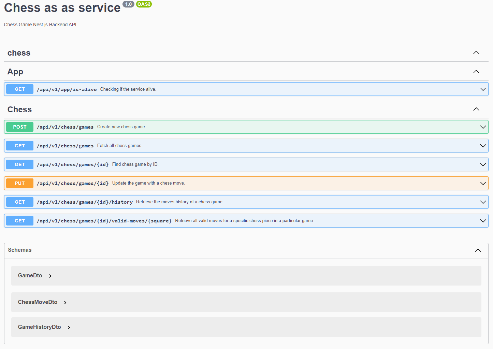

<p align="center">
  <a href="http://nestjs.com/" target="blank"></a>
</p>

[circleci-image]: https://img.shields.io/circleci/build/github/nestjs/nest/master?token=abc123def456
[circleci-url]: https://github.com/ozshimon21/chess-as-a-service

  <p align="center">Chess Game Nest.js Backend API</p>
    <p align="center">
  
  <p align="center">
     <a href="https://chess-as-a-service.azurewebsites.net/swagger" target="blank">Live Demo</a>
  </p>
  
## Description

This project includes an API for managing chess games. The API likely provides endpoints for creating new games,
making moves, retrieving game state, accessing move history, and potentially other game-related operations.
It enables developers to interact with the chess game system programmatically,
integrating it into other applications or building additional features on top of it.

## Installation

```bash
$ npm install
```

## Environment variables

Please edit .env to direct to the mongodb
To edit the `.env` file to direct to MongoDB, follow these steps:

1. Locate the `.env` file in your project directory.
2. Open the `.env` file using a text editor.
3. Look for the variable that specifies the database connection URL `DB_URI` and database name DB_NAME.
4. Update the values of the variables to the connection URL of your MongoDB database.
5. To use a different port for your application instead of the default port 3000, you can
   Set up a new environment variable called 'PORT' and assign it the value of the desired port number (PORT=5000).
6. Save the changes to the `.env` file.

After making the changes, your application should be able to connect to the MongoDB database specified in the `.env` file.
## Running the app

```bash
# development
$ npm run start

# watch mode
$ npm run start:dev

# production mode
$ npm run start:prod
```

## Swagger API

While the application is running, open your browser and navigate to http://localhost:3000/swagger.
You should see the Swagger UI.




## Test

```bash
The project contains the file 'test-api.http'. This file contains sample API queries that can be very useful for testing
and demonstrating the functionality of the API.
```

## License

Nest is [MIT licensed](LICENSE).
